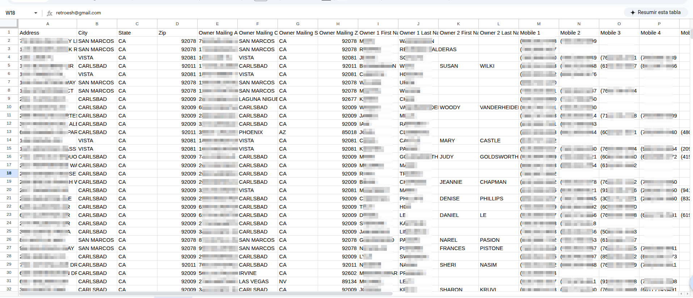

# V-Parse


V-Parse is a CLI tool designed to automate the validation and formatting of CSV files for easy import into Vicidial databases.  
It helps you quickly inspect headers, clean up phone columns, remove unnecessary data, and prepare files for dialer systems.

## The Problem

At work, I was stuck doing a repetitive and time-consuming task.  
I needed to check that a .csv file had the correct format, contained valid data,  
and that everything was properly organized for importing into a database used by a dialer called Vicidial.



After doing this for a while, I started to notice patterns that I could turn into algorithms.  
That realization made me think about automating the process, and that's how V-Parse was born.

## Technologies Used

- **Python `3`**: Main programming language.
- **Rich-Click `1.8.9`** : For building the command-line interface.
- **Pandas `2.3.1` & NumPy `2.3.2`**: For data manipulation and processing.
- **Other dependencies**: See `requirements.txt` for a full list.

## Installation

```bash
# Clone the repository
git clone https://github.com/yourusername/v-parse.git
cd v-parse

# (Optional) Create and activate a virtual environment
python3 -m venv venv
source venv/bin/activate

# Install dependencies
pip install -r requirements.txt
```

## Usage

```bash
# Run the CLI tool with your CSV file
python src/v-parse.py path/to/yourfile.csv
```

You will be presented with a menu to inspect headers, fill phone columns, remove columns, filter data, vicidialize, and save your processed file.

## Author

**Pablo Vergara**